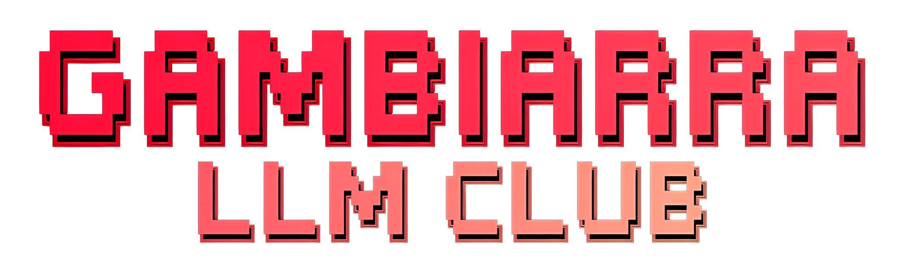

  

# GAMBIARRA LLM CLUB
O primeiro clube de LLMs caseiras do Brasil

# SOBRE O CLUBE

O Gambiarra LLM Club é inspirado no [Homebrew Computer Club](https://en.wikipedia.org/wiki/Homebrew_Computer_Club), o lendário clube de hobbistas que construíam seus próprios computadores na época dos mainframes.

Somos uma comunidade de entusiastas que rodam seus modelos de linguagem localmente, ajustando as configurações para alcançar o melhor resultado que der.

Não temos a pretensão de bater os modelos das big techs. Aqui, a criatividade e a engenhosidade valem mais que os melhores rankings dos benchmarks.

🔧 Rodando LLMs Locais
Traga seu setup, por mais simples que seja. A gambiarra é bem-vinda!

🏆 Competições Criativas
Desafios únicos que testam mais que performance bruta.

🤝 Comunidade
Troca de conhecimento, ferramentas, prompts, LLMs open source.

📅 Encontros Regulares
Mensais ou bimestrais, sempre de forma presencial.

# MANIFESTO DO GAMBIARRA LLM CLUB

Nós, curiosos, malucos e entusiastas das inteligências artificiais caseiras, declaramos: a revolução dos LLMs começa na gambiarra.

Não temos datacenter. Temos um notebook com cooler que parece que vai voar, um PC cheio de esperança e uma vontade incontrolável de experimentar.

Não buscamos vencer benchmarks, nem queremos bater nenhuma big tech com seus super modelos. Queremos construir, brincar e subverter os limites com criatividade e engenhosidade.

Inspirados pelos pioneiros do Homebrew Computer Club, montamos nossos próprios setups, ajustamos parâmetros na unha e fazemos milagre com pouca VRAM. Aqui, cada prompt é um experimento e cada erro, uma descoberta.

O Gambiarra LLM Club é um espaço de encontro para quem prefere rodar local, pensar diferente e aprender junto.

Trazemos nossos modelos open source, conectamos máquinas, trocamos scripts, fazemos testes esquisitos e damos risada das respostas malucas.

Os jogos, experimentos e competições são uma bela desculpa pra gente se reunir e aprender juntos.

Nossas competições não premiam só quem tem a máquina mais potente, mas quem faz mais com menos, quem inventa o uso mais inusitado, quem encarna o personagem mais convincente ou escreve a história mais imprevisível. Valorizamos o improviso e a comunidade.

Aqui, a gambiarra é uma arte.

Se você já tentou rodar um LLM em hardware que mal abre o navegador, se já afinou prompts como quem afina um instrumento desafinado, ou se apenas tem curiosidade de ver até onde dá para ir com boas ideias e ferramentas livres, o clube é seu.

Traga seu hardware. Traga seu modelo. Traga seu espírito maker.

Junte-se ao Gambiarra LLM Club. A criatividade é nosso benchmark.

@fcac 29/07/2025

# JOGOS, EXPERIMENTOS E COMPETIÇÕES

🤖 Bot-a-Bot (Médio)
Dois LLMs conversam tentando manter coerência o maior tempo possível
- Tema livre ou específico
- Avaliação de criatividade
- Consistência de identidade

🌍 Tradução Infinita (Fácil)
Texto passa por cadeia de LLMs traduzindo entre idiomas
- Distorção mínima
- Múltiplos idiomas
- Comparação semântica

🧠 Conhecimento com Pegadinhas (Difícil)
Perguntas gerais com armadilhas e ambiguidades
- Acerto direto: 1pt
- Resposta criativa: 0.5pt
- Sistema de pontuação

📚 Continuação de História (Médio)
Continue narrativas com criatividade e coerência
- Critérios narrativos
- Votação comunitária
- Estilo e humor

🎭 Personagem Oculto (Difícil)
LLM encarna personagem e outros devem adivinhar
- Manter consistência
- Improvisação
- Atuação convincente

⚡ Batalha de Gambiarras (Extremo)
Melhor modelo no hardware mais limitado
- Hardware criativo
- Quantização extrema
- Performance vs recursos

# RECOMPENSAS & EXTRAS

🏆 Troféus Simbólicos:

🥇 GPU de Ouro
Para o setup mais impressionante

🔧 Gambiarra Suprema
Solução mais criativa e improvável

💬 Prompt de Platina
Melhor engenharia de prompt

⚡ Eficiência Máxima
Melhor performance/recurso

🎭 Ator do Ano
Melhor personagem interpretado

🧠 QI Artificial
Respostas mais inteligentes

✨ Benefícios da Comunidade:
- Show & Tell com setups e hacks
- Repositório comunitário de referências e ferramentas
- Discord exclusivo
- Mentoria entre membros

## Em Preparação:
- 📱 App mobile para competições remotas
- 📊 Dashboard de performance histórica
- 🎮 Torneios online entre encontros
- 🛒 Marketplace de prompts e configs